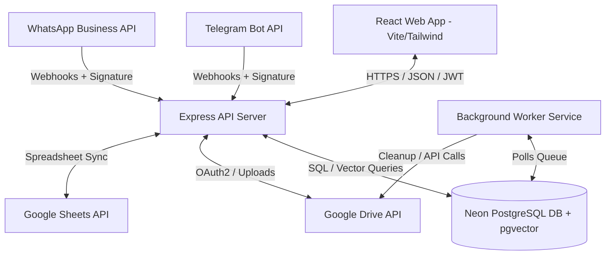

# SPARK — Financial Operations Platform

SPARK is a startup-focused financial operations platform designed to replace spreadsheet-heavy expense tracking with an intelligent, automated, and collaborative workflow. By combining multi-channel document intake (Telegram, WhatsApp, and API), AI-assisted extraction, strict transaction deduplication, pgvector-based semantic search, founder-facing dashboards, and real-time Google Sheets mirroring, SPARK provides startups with automated expense management and cash runway calculations.

---

## Table of Contents
1. [Project Overview & Objectives](#project-overview--objectives)
2. [Key Features](#key-features)
3. [Technology Stack](#technology-stack)
4. [System Architecture](#system-architecture)
5. [Folder & File Structure](#folder--file-structure)
6. [Database Schema Map & Table Dictionary](#database-schema-map--table-dictionary)
7. [Environment Variables (.env) Reference](#environment-variables-env-reference)
8. [Configuration & Customization Details](#configuration--customization-details)
9. [Installation & Local Setup Guide](#installation--local-setup-guide)
10. [Core API Routing Guide](#core-api-routing-guide)
11. [Authentication & Authorization Flow](#authentication--authorization-flow)
12. [Core Workflows & Business Logic](#core-workflows--business-logic)
    - [Ingestion Pipelines (Telegram, WhatsApp, Text)](#1-ingestion-pipelines)
    - [Duplicate Prevention & Ledger Auditing](#2-duplicate-prevention--ledger-auditing)
    - [Vendor Normalization & Fuzzy Resolution](#3-vendor-normalization--fuzzy-resolution)
    - [Grounded RAG Search & Planner](#4-grounded-rag-search--planner)
    - [Dynamic Google Sheets Synchronization](#5-dynamic-google-sheets-synchronization)
13. [Deployment Instructions (AWS Elastic Beanstalk & CI/CD)](#deployment-instructions)
14. [Troubleshooting Guide](#troubleshooting-guide)
15. [Future Improvements](#future-improvements)
16. [Contributors & Team](#contributors--team)

---

## Project Overview & Objectives

Startups often operate in a spreadsheet-heavy financial environment where tracking daily cash transactions, vendor invoices, cloud outlays, and subscription expenses becomes manual and error-prone. SPARK was designed to address this problem directly with the following objectives:

* **Frictionless Document Intake**: Enable founders and team members to submit receipts and expense claims directly from messaging platforms (Telegram and WhatsApp) or via quick text notes.
* **Intelligent Data Extraction**: Leverage AI extraction algorithms to process invoices and receipts, retrieve transaction metadata, confidence levels, and vendor details automatically.
* **Double-Entry & Duplicate Prevention**: Apply cryptographically secure document hashing (SHA-256) and heuristic multi-parameter window matches to prevent duplicate transaction entries.
* **Financial Runway & Burn Intelligence**: Give founders real-time metrics showing historical monthly cash burn, active cash balance on hand, category-level budgets, cash runway in months, and projected depletion dates.
* **Collaborative Google Sheets Synchronization**: Automatically mirror all transactions to a secure, organization-shared Google Sheets workbook complete with multiple time-range tabs (1M, 3M, 6M, 12M spend history) and custom filters.
* **Audit & Governance Queue**: Maintain a review queue for low-confidence or high-value transactions, ensuring strict human-in-the-loop approvals before finalized ledger entry.

---

## Key Features

### 1. Multi-Channel Ingestion Bots
* **Telegram Intake Bot**: Ingests files, PDFs, or raw message texts. Automatically associates them with organizations via join codes and links accounts to system user profiles.
* **WhatsApp Business Webhooks**: Process incoming documents and tokens securely using signature validation, managing short-lived registration tokens and member invite intents.
* **Google Drive Integration**: Auto-archives all incoming invoices, receipts, and text notes in structured, monthly storage directories.

### 2. Transaction Auditing & Duplicate Prevention
* **Crypto-Deduplication**: Computes SHA-256 hashes of all incoming attachments and prevents duplicate uploads within the same organization.
* **Heuristic Deduplication**: Scans historical ledger data for matching amounts and transaction types within a ±7-day window, flagging duplicates and computing a duplicate match score.
* **Comprehensive Audit Trail**: Captures exact modifications to ledger items, saving the before-and-after JSON state, modifier's user ID, and timestamp.

### 3. Financial Runway & Intelligence
* **Cash Runway Projection**: Uses cash balances, income flows, and average monthly outflows (historical 3-month burn) to estimate the cash depletion date.
* **Budget Allocations**: Flags category budgets, firing warning alerts at 80% limit utilization and critical alerts at 100%.
* **Spike Alerts**: Flags suspicious individual expense outlays exceeding $500 and 1.5x of the 3-month category average.

### 4. Semantic Search & Grounded RAG
* **Relevance-Scored Search**: Matches transactions by text tags, categories, vendor names, or document text using multi-column SQL constraints and calculated relevance.
* **Grounded Answer Generator**: Routes natural language queries (e.g., *"How much did we spend on software in March?"*) to summarize matches and list citations complete with transaction IDs and confidence.

### 5. Dynamic Google Sheets Mirroring
* **Automatic Synchronization**: Generates an organization-owned workbook `SPARK Transactions - [Org Name]`.
* **Multi-Window Tabs**: Divides transaction lists dynamically into time-range tabs (**1M**, **3M**, **6M**, and **12M**).
* **Auto-Formatting**: Standardizes sheets with frozen headers, category filters, column widths, and direct editing permissions for team members.

---

## Technology Stack

### Backend
* **Runtime Environment**: Node.js (v20 or higher)
* **Framework**: Express.js (REST API Gateway)
* **Database**: PostgreSQL (Neon Serverless) with `pgvector` for high-dimensional similarity searches and `pg_trgm` for trigram vendor resolution.
* **Authentication**: JSON Web Tokens (JWT) with HS256 algorithm and cryptographically secure password hashing (BCrypt).
* **Integrations**: Google APIs Client Library (`googleapis` v171.4.0) for OAuth2, Drive, and Sheets.

### Frontend
* **Core Library**: React (v19)
* **Build System**: Vite
* **Styling**: Tailwind CSS (v4) with vanilla CSS components
* **Routing**: React Router DOM (v7)
* **Data Visualization**: Recharts (v3)

---

## System Architecture

SPARK runs as a decoupled, multi-container system:



* **React Web App**: Serves the user dashboard, transaction approvals queue, analytics, configurations, and team settings.
* **Express API Server**: Serves as the central API gateway. Handles user requests, webhook integrations, signature verification, token logic, and core services.
* **PostgreSQL Database**: Holds tables for organizations, users, transactions, documents, audit logs, and embedding jobs. Uses `pgvector` for similarity matching.
* **Background Worker Service**: Runs an asynchronous loop to clean up orphaned Google Drive files when transaction inserts fail.

---

## Folder & File Structure

```
SPARK/
├── .github/
│   └── workflows/
│       └── deploy.yml          # GitHub Actions CI/CD to AWS Elastic Beanstalk
├── client/                     # Frontend Application
│   ├── public/                 # Static Assets
│   ├── src/
│   │   ├── app/                # Global configuration & routes
│   │   ├── assets/             # Images & static graphics
│   │   ├── components/         # Reusable layouts and custom UI widgets
│   │   ├── features/           # Feature modules (Dashboard, Login, Signup)
│   │   ├── hooks/              # Custom React Hooks
│   │   ├── lib/                # Client state, settings & utilities
│   │   ├── pages/              # Primary route views (Analytics, Approvals, Integrations, etc.)
│   │   ├── services/           # HTTP, endpoints & API connection helper
│   │   ├── styles/             # Global CSS themes
│   │   ├── App.jsx             # Main router and Auth link listener
│   │   └── main.jsx            # React root mount
│   ├── package.json
│   └── vite.config.js
├── server/                     # Backend Application
│   ├── src/
│   │   ├── api/                # API Routing prefixes
│   │   ├── config/             # Config loader & environment validator (env.js)
│   │   ├── controllers/        # Express Route Handlers (Auth, Dashboard, Ingestion, RAG, etc.)
│   │   ├── db/                 # Database connection & SQL Repositories
│   │   │   ├── migrations/     # Versioned database migration scripts (001-007)
│   │   │   ├── pool.js         # PG Pool Client
│   │   │   └── seed-realistic.js # Realistic transaction seed data script
│   │   ├── integrations/       # Native Google Drive & Google Sheets wrappers
│   │   ├── middleware/         # Custom Middlewares (JWT Auth, Org Validation, Webhook Signature checks)
│   │   ├── modules/            # Domain-specific backend logic modules
│   │   ├── routes/             # REST Route mappings
│   │   ├── services/           # Business Logic Layer (Auth, Ingestion, Sheets, RAG, Vendor, etc.)
│   │   ├── utils/              # Cryptography, File, and normalization helpers
│   │   ├── app.js              # Express app definition & parsing setup
│   │   ├── server.js           # Server startup script
│   │   └── worker.js           # Background worker loop entry
│   ├── tests/                  # Integration and unit test suite
│   ├── package.json
│   └── .python-version
├── tools/                      # Helper Scripts & Report Builders
│   ├── build_spark_report.py   # PDF merging and report generator script
│   └── repair_spark_pdf.py     # PDF table-of-contents overlay builder
├── Dockerfile                  # Multi-stage production Docker build
├── Dockerfile.worker           # Production worker Docker build
├── docker-compose.yml          # Container orchestration configuration
├── docker-compose.prod.yml     # Production overrides for compose
├── Makefile                    # Automation shortcuts (migrate, seed, test, docker-run)
└── README.md                   # Project Documentation
```

---

## Database Schema Map & Table Dictionary

### Schema ER Diagram

```mermaid
erDiagram
    users {
        uuid id PK
        text email UK
        text first_name
        text password_hash
        bigint telegram_id UK
        bigint whatsapp_id UK
        timestamptz created_at
        timestamptz updated_at
    }
    
    organizations {
        uuid id PK
        text name
        text join_code UK
        text insights_frequency
        text insights_recipients
        timestamptz created_at
        timestamptz updated_at
    }
    
    organization_members {
        uuid id PK
        uuid organization_id FK
        uuid user_id FK
        text role
        boolean receive_insights
        timestamptz created_at
    }
    
    vendors {
        uuid id PK
        uuid organization_id FK
        text canonical_name
        text normalized_name
        timestamptz created_at
        timestamptz updated_at
    }
    
    vendor_aliases {
        uuid id PK
        uuid organization_id FK
        uuid vendor_id FK
        text alias
        text normalized_alias
    }

    google_integrations {
        uuid id PK
        uuid organization_id FK
        uuid owner_user_id FK
        text google_email
        bytea refresh_token_ciphertext
        bytea refresh_token_iv
        bytea refresh_token_tag
        text drive_root_folder_id UK
        text transactions_sheet_id
        timestamptz created_at
        timestamptz updated_at
    }

    finance_settings {
        uuid organization_id PK, FK
        numeric opening_cash_balance
        date opening_cash_effective_date
        timestamptz created_at
        timestamptz updated_at
    }

    category_budgets {
        uuid id PK
        uuid organization_id FK
        text category
        text normalized_category
        numeric monthly_limit
        timestamptz created_at
        timestamptz updated_at
    }

    transactions {
        uuid id PK
        uuid organization_id FK
        numeric amount
        text raw_vendor
        uuid vendor_id FK
        text transaction_type
        text category
        date transaction_date
        numeric confidence_score
        uuid duplicate_of_transaction_id FK
        numeric duplicate_score
        text status
        timestamptz created_at
    }

    documents {
        uuid id PK
        uuid transaction_id FK
        uuid organization_id FK
        text storage_kind
        text drive_file_id
        text drive_folder_id
        text original_name
        text stored_name
        text file_type
        char content_hash
        text text_content
        text extracted_text
        numeric extraction_confidence
        text extraction_method
        text extraction_version
        text extraction_error
        timestamptz uploaded_at
    }

    transaction_embeddings {
        uuid transaction_id PK, FK
        vector embedding
        timestamptz created_at
    }

    embedding_jobs {
        uuid id PK
        uuid transaction_id FK
        uuid organization_id FK
        text status
        int attempt_count
        int max_attempts
        timestamptz next_attempt_at
        text last_error
        timestamptz created_at
        timestamptz updated_at
    }

    ingestion_jobs {
        uuid id PK
        uuid organization_id FK
        text source
        text file_name
        text status
        text platform
        text error_message
        timestamptz created_at
        timestamptz completed_at
    }

    orphan_drive_files {
        uuid id PK
        uuid organization_id FK
        text drive_file_id
        text cleanup_status
        timestamptz created_at
    }

    approvals {
        uuid id PK
        uuid transaction_id FK
        uuid approved_by FK
        timestamptz approved_at
    }

    audit_logs {
        uuid id PK
        uuid user_id FK
        uuid transaction_id FK
        text action
        jsonb previous_value
        jsonb new_value
        timestamptz timestamp
    }

    users ||--o{ organization_members : belongs_to
    users ||--o{ google_integrations : owns
    users ||--o{ approvals : approves
    users ||--o{ audit_logs : logs
    organizations ||--o{ organization_members : contains
    organizations ||--o{ google_integrations : configures
    organizations ||--|| finance_settings : configures
    organizations ||--o{ category_budgets : defines
    organizations ||--o{ transactions : records
    organizations ||--o{ vendors : has
    vendors ||--o{ vendor_aliases : has
    transactions ||--o{ documents : has
    transactions ||--o| transaction_embeddings : has
    transactions ||--o| approvals : has
    transactions ||--o{ audit_logs : logs
    transactions ||--o| embedding_jobs : triggers
    organizations ||--o{ ingestion_jobs : tracks
    organizations ||--o{ orphan_drive_files : cleans
```



### Table Dictionary

| Table Name | Description | Key Fields & Datatypes |
| :--- | :--- | :--- |
| **`users`** | Individual platform account credentials and profiles. | `id` (UUID PK), `email` (TEXT), `password_hash` (TEXT), `telegram_id` (BIGINT), `whatsapp_id` (BIGINT). |
| **`organizations`** | Legal startup/business entities managing transactions. | `id` (UUID PK), `name` (TEXT), `join_code` (TEXT UNIQUE), `insights_frequency` (TEXT), `insights_recipients` (TEXT). |
| **`organization_members`** | Maps platform permissions and roles. | `organization_id` (UUID FK), `user_id` (UUID FK), `role` (`founder`, `co-founder`, `admin`, `member`), `receive_insights` (BOOL). |
| **`vendors`** | Canonical vendor profiles resolved to prevent duplicates. | `id` (UUID PK), `organization_id` (UUID FK), `canonical_name` (TEXT), `normalized_name` (TEXT). |
| **`vendor_aliases`** | Raw spelling variations mapped to canonical vendors. | `id` (UUID PK), `vendor_id` (UUID FK), `alias` (TEXT), `normalized_alias` (TEXT). |
| **`google_integrations`** | OAuth tokens, Drive folder, and Sheet links. | `organization_id` (UUID FK), `google_email` (TEXT), `refresh_token_ciphertext` (BYTEA), `drive_root_folder_id` (TEXT). |
| **`finance_settings`** | Startup settings, cash balances, and opening balances. | `organization_id` (UUID PK), `opening_cash_balance` (NUMERIC), `opening_cash_effective_date` (DATE). |
| **`category_budgets`** | Monthly limits set per expense category. | `organization_id` (UUID FK), `category` (TEXT), `normalized_category` (TEXT), `monthly_limit` (NUMERIC). |
| **`transactions`** | Core ledger transactions. | `id` (UUID PK), `amount` (NUMERIC), `vendor_id` (UUID FK), `transaction_type` (`expense`, `income`, `salary`), `status` (`auto_verified`, `pending_review`). |
| **`documents`** | Receipt metadata, OCR text, and storage locations. | `transaction_id` (UUID FK), `storage_kind` (`google_drive`, `inline_text`), `drive_file_id` (TEXT), `content_hash` (CHAR(64)). |
| **`transaction_embeddings`** | Calculated 384-dimension text embeddings. | `transaction_id` (UUID PK), `embedding` (VECTOR(384)). |
| **`embedding_jobs`** | embedding job processing queue. | `transaction_id` (UUID FK), `status` (`pending`, `processing`, `completed`, `failed`), `attempt_count` (INT). |
| **`ingestion_jobs`** | Receipt ingestion bot webhook processing queue. | `id` (UUID PK), `source` (`telegram`, `whatsapp`, `text`), `status` (`processing`, `completed`, `failed`). |
| **`orphan_drive_files`** | Files to delete if transaction inserts fail. | `drive_file_id` (TEXT), `cleanup_status` (`pending`, `deleted`, `failed`). |
| **`approvals`** | Tracks authorized transactions. | `transaction_id` (UUID FK), `approved_by` (UUID FK), `approved_at` (TIMESTAMPTZ). |
| **`audit_logs`** | Complete transaction modification log. | `user_id` (UUID FK), `transaction_id` (UUID FK), `action` (TEXT), `previous_value` (JSONB), `new_value` (JSONB). |

---

## Environment Variables (.env) Reference

The SPARK platform uses environment variables configured either inside the `server/.env` file (local setup) or in the root `.env` file (when orchestrating services through Docker Compose).

| Env Variable Name | Required? | Default/Example | Purpose |
| :--- | :--- | :--- | :--- |
| **`PORT`** | No | `4000` | Local HTTP Port for Express Server. |
| **`NODE_ENV`** | No | `development` | Server runtime mode (`development`, `production`). |
| **`DATABASE_URL`** | Yes | `postgresql://...` | Connection URI pointing to a pgvector-enabled PostgreSQL. |
| **`DATABASE_SSL`** | No | `true` | Must be `true` for hosted Neon/AWS databases that require TLS. |
| **`JWT_SECRET`** | Yes | `your-secret-key` | Secret string utilized to sign access JSON Web Tokens. |
| **`REFRESH_JWT_SECRET`**| No | `your-refresh-secret`| Secret string utilized to sign refresh JSON Web Tokens. |
| **`TELEGRAM_JWT_SECRET`**| No | `your-telegram-secret`| Secret string utilized to sign Telegram linking payloads. |
| **`APP_BASE_URL`** | No | `http://localhost:5173`| Direct domain URL of the client app interface. |
| **`TELEGRAM_BOT_USERNAME`**| No | `osman80bot` | Username of the associated Telegram bot account. |
| **`WHATSAPP_BOT_NUMBER`** | No | `+14155552671` | Number of the associated WhatsApp Business profile. |
| **`GOOGLE_CLIENT_ID`** | No | `your-client-id.apps...`| Google Cloud credentials for OAuth2 integration. |
| **`GOOGLE_CLIENT_SECRET`**| No | `your-client-secret` | Google Cloud credentials for OAuth2 integration. |
| **`GOOGLE_REDIRECT_URI`** | No | `http://localhost:.../callback`| Callback webhook redirect mapped in Google Console. |
| **`GOOGLE_TOKEN_ENCRYPTION_KEY`**| No | `32-byte-hex-key` | Cryptographic key to encrypt/decrypt Drive tokens in DB. |
| **`WEBHOOK_SECRET`** | Yes | `your-webhook-secret` | HMAC key to verify Telegram, WhatsApp, and scheduling requests. |
| **`INGESTION_MAX_BODY_BYTES`**| No | `15728640` | Ingestion payload limit (defaults to 15MB). |
| **`ORPHAN_CLEANUP_INTERVAL_MS`**| No | `60000` | Delay between orphan Drive file worker runs (default: 60s). |
| **`EXTRACTION_CONFIDENCE_THRESHOLD`**| No| `0.80` | Score threshold below which transactions route to pending review. |
| **`EXTRACTION_MAX_TEXT_CHARS`**| No| `12000` | Maximum characters processed from document text. |
| **`RAG_MAX_TOP_K`** | No | `20` | Maximum number of transactions retrieved for RAG context. |
| **`RAG_MAX_QUERY_CHARS`** | No | `512` | Character limit for incoming RAG search queries. |

---

## Configuration & Customization Details

### Webhook Signatures
Ingestion webhooks require an HMAC SHA-256 signature in the `x-spark-signature` header:
* For JSON text ingestion: `crypto.createHmac('sha256', env.webhookSecret).update(req.rawBody).digest('hex')`
* For file uploads: `crypto.createHmac('sha256', env.webhookSecret).update(fields.payload).digest('hex')`

### OCR Confidence & Review Routing
When an ingestion job finishes:
* If the OCR confidence score falls below `EXTRACTION_CONFIDENCE_THRESHOLD` (e.g., `0.8`), or is flagged by the duplicate matching engine, the transaction status is set to `pending_review`.
* If it succeeds with high confidence, the status is set to `auto_verified` and it is added to the active ledger.

---

## Installation & Local Setup Guide

### Prerequisites
* **Node.js**: v20 or higher
* **npm**: v10 or higher
* **PostgreSQL**: v16 with `pgvector` and `pg_trgm` extensions enabled.
* **Docker / Docker Compose** (Optional, for containerized runtimes)

### Option 1: Manual Setup

1. **Clone the Repository & Install Dependencies**:
   ```bash
   git clone https://github.com/Osman-bin-nasir/SPARK.git
   cd SPARK
   
   # Install Backend dependencies
   cd server && npm install
   
   # Install Frontend dependencies
   cd ../client && npm install
   ```

2. **Configure Environment Variables**:
   * Create `server/.env` based on `server/.env.example` (or the root `.env.example`).
   * Generate secure JWT secrets:
     ```bash
     node -e "console.log(require('crypto').randomBytes(32).toString('hex'))"
     ```

3. **Run Database Migrations & Seeds**:
   ```bash
   cd ../server
   
   # Run schema migrations
   npm run migrate
   
   # Populate ledger with realistic historical data
   npm run seed:startup-demo
   ```

4. **Start Development Servers**:
   ```bash
   # Run Express Backend (API runs at http://localhost:4000)
   npm run dev
   
   # In a new terminal, run Vite Frontend (Client runs at http://localhost:5173)
   cd ../client
   npm run dev
   ```

---

### Option 2: Docker Compose Setup

Run the multi-container environment locally:

```bash
# 1. Setup local environment variables
cp .env.example .env

# 2. Start PostgreSQL, API Server, Client, and Background Worker
docker compose up --build
```
* Once started, access the Web App at `http://localhost:8000` (port `8000` is exposed as the production proxy gateway).
* Run migrations in the running container:
  ```bash
  docker exec spark-app npm run migrate
  docker exec spark-app npm run seed:startup-demo
  ```
* To include the background worker service:
  ```bash
  docker compose --profile worker up --build
  ```

---

## Core API Routing Guide

Prefix all API endpoints with `/api`. Headers should include:
* `Authorization: Bearer <JWT_ACCESS_TOKEN>` (for protected routes)
* `X-Organization-Id: <ORGANIZATION_UUID>` (for organization-scoped routes)
* `X-Spark-Signature: sha256=<HMAC_SIGNATURE>` (for incoming webhooks)

### 1. Authentication (`/api/auth`)
* `POST /signup` — Register email, name, password. Automatically configures a default organization.
* `POST /login` — Logs in using credentials; returns access token (short-lived) and refresh token (long-lived).
* `POST /refresh` — Regenerates access tokens using refresh tokens.
* `POST /create-telegram-login` — Generates a temporary linking link for Telegram bot users.
* `POST /telegram` — Consumes a Telegram login token to link the profile.
* `POST /create-whatsapp-login` — Generates a temporary linking link for WhatsApp bot users.
* `POST /whatsapp` — Consumes a WhatsApp login token to link the profile.
* `POST /link-telegram` — Manually links active session to a Telegram ID (requires Auth).
* `POST /unlink-telegram` — Unlinks Telegram from the profile (requires Auth).

### 2. Dashboard & Metrics (`/api/dashboard`)
* `GET /` — Returns runway metrics, monthly cash burn averages, category budgets, cash on hand, and budget/spike alerts.
* `GET /config` — Retrieves finance settings (opening balance, date).
* `PUT /config` — Updates finance settings (requires founder/admin role).
* `GET /budgets` — Lists active budgets.
* `PUT /budgets` — Replaces budget configuration array (requires founder/admin role).

### 3. Google Drive Integration (`/api/google-drive`)
* `POST /connect-url` — Generates Google OAuth redirect URL.
* `GET /callback` — OAuth Callback redirect. Stores keys and sets up target directories.
* `GET /status` — Retrieves status (connected email, folder ID).

### 4. Document Ingestion Webhooks (`/api/ingestion`)
* `POST /document` — Webhook for file ingestion (multimodal receipt upload).
* `POST /text` — Webhook for text-based expense notes.

### 5. Ledger Transactions (`/api/transactions`)
* `GET /` — Filterable and paginated list of transactions (by page, page size, status, type, vendor, start_date, end_date).
* `POST /` — Manually inserts a transaction (requires founder/admin role).
* `GET /google-sheets` — Triggers/retrieves Google Sheets transaction mirror link.
* `POST /search` — Matches transactions using text query filters.
* `GET /:id` — Details of a specific transaction including audit history.
* `PATCH /:id` — Updates transaction fields; logs old values to audit logs (requires founder/admin role).
* `DELETE /:id` — Deletes transaction and marks drive file for background worker cleanup (requires founder/admin role).
* `GET /:id/document` — Fetches the attached document file (returns inline content or Google Drive buffer).

### 6. RAG Answer Engine (`/api/rag`)
* `POST /answer` — Answers natural language queries about expenses with statistical summaries and citations.

---

## Authentication & Authorization Flow

```
1. Client Signup/Login ───────────> Generate JWT Tokens
2. Link Bot Account ──────────────> Generate Telegram/WhatsApp Token (expires in 15 mins)
3. Bot Action ────────────────────> Match Bot Join Intent ───> Add organization member
```

* **Access Token**: Short-lived (15-minute) JWT containing user and organization context.
* **Refresh Token**: Long-lived (7-day) JWT used to rotate access tokens without forcing re-authentication.
* **Organization Context**: Checked using `requireOrganizationMembership` middleware. Scopes incoming requests to ensure users only access transactions belonging to their organization.

---

## Core Workflows & Business Logic

### 1. Ingestion Pipelines
When a file receipt or text note is ingested via `/api/ingestion/document` or `/api/ingestion/text`:
1. **Signature Verification**: Validates the webhook signature using `WEBHOOK_SECRET`.
2. **Duplication Check**: Computes a SHA-256 hash of the buffer. If it matches a document in the database, the upload is rejected.
3. **Folder Resolution**: Locates or creates a structured path in Google Drive (`/documents/YYYY/MM/[expense|income|salary]/`).
4. **File Archive**: Uploads the file to Google Drive.
5. **Ledger Registry**: Stores the transaction in the database. If database insertion fails, the drive file ID is logged in the `orphan_drive_files` queue for cleanup.

### 2. Duplicate Prevention & Ledger Auditing
To prevent duplicate entries from manual errors:
* **Heuristic Deduplication**: Scans historical ledger data for matching amounts and transaction types within a ±7-day window.
* **Duplicate Score Calculation**:
  * Base score: `0.45`
  * Matching vendor names: `+0.35` (Partial matching: `+0.15`)
  * Matching transaction types: `+0.10`
  * Matching dates: `+0.10` (Within 3 days: `+0.05`)
* **Review Routing**: If the duplicate score is `0.85` or higher, the transaction status is set to `pending_review` and it is routed to the approvals queue.

### 3. Vendor Normalization & Fuzzy Resolution
To prevent vendor duplicate profiles:
* **Normalization**: Strips corporate suffixes (`Pvt`, `Ltd`, `Inc`, `LLC`, `Services`, `Solutions`) and converts names to lowercase.
* **Fuzzy Matching**: Uses PostgreSQL `pg_trgm` to calculate cosine similarity with existing vendor aliases:
  * **High Match (> 0.85)**: Maps the transaction to the canonical vendor and saves the new alias.
  * **Medium Match (0.65 - 0.85)**: Maps the transaction to the canonical vendor but does not save the alias.
  * **Low Match (< 0.65)**: Creates a new canonical vendor profile.

### 4. Grounded RAG Search & Planner
```
Natural Language Query ──> Generate Search Filters ──> SQL Match ──> Summarize Stats ──> Grounded Answer
```
1. **Query Generation**: Extracts filters (vendors, categories, date limits) from natural language input.
2. **Database Retrieval**: Runs an optimized SQL query using text filters, categories, vendors, and dates.
3. **Relevance Calculation**: Calculates relevance scores based on matched fields (e.g., vendor matches get `1.0`, categories get `0.85`, types get `0.75`).
4. **Grounded Synthesis**: Computes key stats (total matches, total amount, top categories, top vendors) and generates a structured deterministic answer with complete citations.

### 5. Dynamic Google Sheets Mirroring
1. **Spreadsheet Resolution**: Looks up the linked spreadsheet in Google Drive. If missing, it creates a new workbook (`SPARK Transactions - [Org Name]`) and stores its ID.
2. **Sheet Isolation**: Checks for and creates tabs for the four target windows: `1M Spend`, `3M Spend`, `6M Spend`, and `12M Spend`.
3. **Row Replacement**: Queries transactions for each time window and replaces the sheet rows.
4. **Visual Formatting**: Standardizes formatting (freezes header rows, sets colors, adds filters, adjust column widths).
5. **Permissions sharing**: Shares write permissions with all organization member emails.

---

## Deployment Instructions

SPARK is configured for automated CI/CD and deployment to **AWS Elastic Beanstalk (Docker Platform)**:

### 1. Production Dockerfile
The project utilizes a simplified backend [Dockerfile](./Dockerfile) built on `node:20-alpine`:
* Proper signal handling implemented via `dumb-init`.
* Runs as a secure non-root `nodejs` container user.
* Exposes port `4000`.
* Embeds a container `HEALTHCHECK` pointing to `/health`.
* Runs automatic migration scripts prior to starting the Express server.

### 2. GitHub Actions Deployment
The workflow [.github/workflows/deploy.yml](./.github/workflows/deploy.yml) triggers automated deployments on pushes to `main`:
1. Zips project source code, Docker configs, and dependencies.
2. Deploys using the `einaregilsson/beanstalk-deploy` action.
3. Automatically maps AWS environment variables.
4. Uses `use_existing_version_if_available: true` to handle workflow reruns safely.

### 3. DNS and HTTPS Setup
* **ACM SSL Certs**: SSL termination is handled by AWS Certificate Manager (ACM) by binding a public SSL certificate (for `api.sparkmetrics.online`) directly to an HTTPS listener on port 443 of the Elastic Beanstalk load balancer.
* **CNAME records**: Custom subdomain `api.sparkmetrics.online` points via a CNAME record directly to the Elastic Beanstalk endpoint:
  * Target: `spark-backend-env.eba-ggwipqh2.us-east-1.elasticbeanstalk.com`

---

## Troubleshooting Guide

### Container Fails to Start
* **Error**: `Connection refused to postgres:5432`
* **Fix**: Ensure that the database service is running and healthy. In Docker Compose, verify that `postgres` is listed as healthy.
* **Error**: `Missing required environment variables`
* **Fix**: Validate that `DATABASE_URL` and `JWT_SECRET` are correctly configured in `server/.env` or the Docker environment.

### Database Issues
* **Error**: `relation "users" does not exist`
* **Fix**: Database migrations haven't run. Run `npm run migrate` (locally) or `docker exec spark-app npm run migrate`.

### Google Drive Scope Issues
* **Error**: `403 Insufficient Scope` or `not have permission` when syncing sheets.
* **Fix**: Reconnect the Google Drive integration. Make sure to request and grant access to the `https://www.googleapis.com/auth/drive.file` and `https://www.googleapis.com/auth/spreadsheets` scopes during OAuth consent.

### Webhook Failures
* **Error**: `401 Invalid webhook signature`
* **Fix**: Verify that the `WEBHOOK_SECRET` environment variable matches on both the sender application and the SPARK server.

---

## Future Improvements

* **LLM-Based Parser Integration**: Replace regex parsing with LLMs (e.g., Gemini Flash) to parse complex layouts and multi-item invoices.
* **Bank Feed Integration**: Connect directly to Plaid or Yodlee to sync transactions and reconcile files automatically.
* **Interactive Bot Interface**: Allow users to query financial metrics and request reports directly inside Telegram and WhatsApp.
* **Mobile Companion App**: Deploy dedicated iOS and Android clients for receipt capture and transaction approvals on the go.

---

## Contributors & Team

SPARK was built and developed as a collaborative mini-project under the guidance of our college faculty:

* **Osman Bin Nasir** — (Roll: 1604-23-733-080)
* **Saif Ali Baig** — (Roll: 1604-23-733-082)
* **Abdul Razzaq** — (Roll: 1604-23-733-108)

#### Under the Guidance of:
* **Mr. Mohammed Saleem Khan** (Assistant Professor, Dept of CSE)
* **Dr. Syed Shabbeer Ahmad** (HOD, Dept of CSE)
